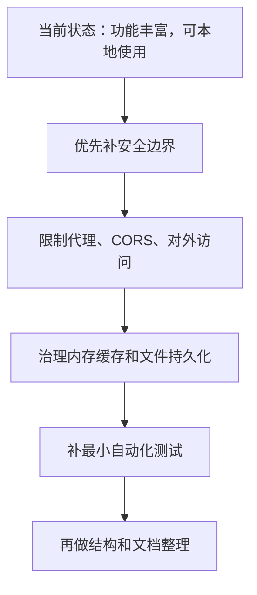

# musicdl 代码 Review 报告

审查时间：2026-06-30  
审查范围：`musicdl` Python 核心库、`web` 前后端、Docker/依赖配置、基础文档  
结论：项目功能覆盖很强，已经从命令行工具扩展成了可用的 Web 播放/下载体验；但如果要长期运行或对外部署，当前安全边界、缓存治理、测试体系还不够。

一句话拍板：适合本机/小范围自用；如果要公网、局域网多人用，先不要直接上线，先处理 P1。

## 总体评价

| 维度 | 评价 | 说明 |
|------|------|------|
| 产品完整度 | 较好 | CLI、Web、搜索、播放、歌词、下载、歌单、Docker 都有，功能面很完整。 |
| 代码可读性 | 中等 | 模块拆分有基本边界，但大量一行多语句、宽泛异常吞掉问题，后期排障会吃力。 |
| 稳定性 | 中等偏弱 | 外部音乐源本来就不稳定，代码又缺少错误可观测性和缓存上限，长时间运行风险偏高。 |
| 安全性 | 偏弱 | Web 服务默认开放 CORS、绑定 `0.0.0.0`，还提供外部 URL 代理。只适合受信任环境。 |
| 测试与发布 | 偏弱 | 没发现自动化测试和 CI；前端能构建，Python 能编译，但缺少行为级保护网。 |

建议评分：**6.5 / 10**。它是一个功能推进很快的项目，不是一个已经准备好“放心长期部署”的服务。

## 主要问题

| 优先级 | 问题 | 影响 | 证据 | 建议 |
|--------|------|------|------|------|
| P1 | Web 服务安全边界太松 | 服务一旦暴露到公网/局域网，别人可以直接调用搜索、播放、下载、歌单写入接口；`/api/cover` 还能请求任意 URL，容易变成内网探测或流量转发入口。 | `web/backend.py:30`、`web/backend.py:413`、`Dockerfile:49` | 默认只监听 `127.0.0.1`；CORS 改为白名单；`/api/cover` 限制域名、禁止内网 IP、限制大小和超时；需要多人使用时加简单认证。 |
| P1 | 内存缓存没有上限 | 搜索词、页码、歌曲对象会不断进入内存；过期数据只是不再命中，并没有清理。长时间运行后内存会持续涨。 | `web/api/session.py:76`、`web/api/session.py:80`、`web/api/session.py:132`、`web/api/session.py:136` | 换成有最大容量的 TTL 缓存，例如“最多 N 个关键词、最多 N 首歌”；定期清理过期项。 |
| P2 | 歌单 JSON 存储只适合单进程 | 当前用进程内锁保护单个 JSON 文件；如果以后开多个 uvicorn worker、多个容器或共享目录，写入会互相覆盖。 | `web/api/playlists.py:30`、`web/api/playlists.py:65` | 明确文档写“仅支持单进程”；或改 SQLite，这个体量下最省心。 |
| P2 | 错误被大量吞掉 | 上游接口变化、超时、解析失败都会变成空列表；用户看到的是“没结果”，开发者也难快速定位。 | `web/api/session.py:124`、`web/api/session.py:266`、`web/backend.py:74` | 至少记录来源、关键词、异常类型；前端区分“无结果”和“源异常”。 |
| P2 | 下载失败时会自动降级关闭 TLS 校验 | HTTPS 校验失败后直接 `verify=False` 再请求，可能放大中间人风险。 | `musicdl/modules/sources/base.py:217` | 改成显式配置项；默认不要关闭 TLS 校验，只对已知特殊源做受控例外。 |
| P2 | 音乐源顺序不稳定 | `set()` 会打乱用户配置顺序，CLI/Web 展示和执行顺序可能每次不同。 | `musicdl/musicdl.py:58` | 用“保序去重”，比如 `dict.fromkeys(...)`。 |
| P3 | 文档和实现有轻微漂移 | Web README 写 Vite 7、默认 5 个源；当前前端依赖是 Vite 8，Web 默认源是 3 个。 | `web/README.md:8`、`web/README.md:86`、`web/api/session.py:30` | 顺手修文档，避免新人按错预期排查。 |
| P3 | 缺少自动化测试 | 没发现测试目录、pytest 配置或 CI；后续改源解析/播放代理很容易回归。 | 仓库扫描结果 | 先补 5 类最小测试：URL 校验、缓存淘汰、歌单存储、流式接口、CLI 参数解析。 |

## 值得肯定的地方

| 优点 | 说明 |
|------|------|
| 功能链路完整 | 从搜索到播放、歌词、下载、歌单管理都有闭环，不是半成品 demo。 |
| Web 体验有意识地做了流式返回 | SSE 分批返回能明显改善“搜索一直等”的感受。 |
| 源客户端扩展性不错 | 不同平台集中在 `musicdl/modules/sources`，新增源有明确位置。 |
| Docker 化已经具备 | 对普通用户来说，`docker compose up` 的门槛比手装 Python/Node 低很多。 |

## 推荐修复顺序

推荐先做前两步。原因很简单：它们不改变产品功能，但能立刻降低被滥用和跑久崩掉的风险。

## 验证结果

| 检查项 | 命令 | 结果 |
|--------|------|------|
| 前端生产构建 | `npm run build` | 通过 |
| Python 语法编译 | `python3 -m compileall musicdl web mcp scripts` | 通过 |
| Python 依赖一致性 | `python3 -m pip check` | 通过 |
| 测试 | 未运行 | 仓库内没发现现成测试入口 |

